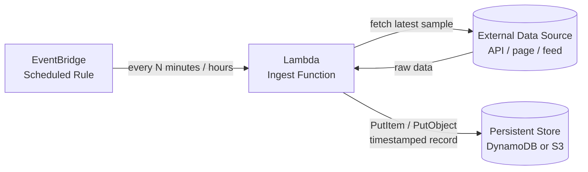
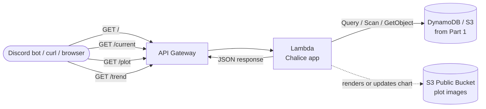

# DS5220 — Data Project 3

Our final project has **two parts**, and they should be built to fit together:

1. **A data ingestion pipeline** — a cloud-based, serverless process that continually tracks a *meaningful, changing* data source and writes it to a persistent store.
2. **An integration API** — an API Gateway + Lambda service (built with [Chalice](https://aws.github.io/chalice/)) that exposes at least **three** resources on top of the data you've been collecting. At least **one** of those resources must return the URL of a publicly readable plot (PNG/JPG/GIF) stored in S3.

Your deployed API will be discoverable and callable from the course Discord bot (`/project <project-id>`), so the wire format is fixed — see [API Contract](#api-contract) below.

Please use the `#dp3` channel for your registration, listing, testing, etc.

---

## Part 1 — The Ingestion Pipeline / Project

### Data Source

Pick a data source that **changes over time** and is interesting enough to be worth tracking. A few reasonable ideas to get you thinking:

- **Public APIs** — weather, transit arrivals, air quality, USGS earthquakes, stock/crypto prices, NOAA buoys, GitHub repo stars, Wikipedia pageviews, Reddit post counts, ISS position, flight tracking, Steam player counts.
- **Scraped pages** — a site's front page headlines, a price on a product page, a leaderboard, a job board listing count. (Respect `robots.txt` and rate limits.)
- **Your own signal** — anything you can measure periodically and want a time series for.

What makes a source "meaningful"?

- It **changes on a cadence your schedule can capture** (minutes, hours, days — not once a year).
- One sample on its own is uninteresting, but a *series* of samples reveals something (a trend, a spike, a distribution).
- The thing you want to show later (current value, a plot over a window, a computed trend) falls out naturally from the data you're collecting.

### Architecture



### What You're Building

| Component | Description |
|-----------|-------------|
| **A CloudWatch Timer rule** | A cron/rate schedule that fires on a sensible cadence for your source (e.g. `rate(15 minutes)`, `rate(1 hour)`). |
| **Ingest Lambda** | Fetches the current value(s) from your source and writes a timestamped record to the store. Should be idempotent and handle upstream failures without crashing. |
| **Persistent store** | DynamoDB is the default choice; S3 (JSONL / Parquet) is fine for append-heavy data. The schema is up to you — design it around the queries your API needs to answer. |

### Key Implementation Notes

- **Timestamp every record.** Use a Unix timestamp or long `datetime` as a sort key in DynamoDB — almost every later query will sort or filter by time.
- **Don't trust the source.** Wrap the fetch in a `try/except`, log failures to CloudWatch, and return cleanly so a bad upstream response doesn't throw off the schedule.
- **Mind your cadence.** Free-tier APIs often rate-limit; `rate(1 minute)` is rarely what you want. Pick the slowest cadence that still captures the behaviour you care about.
- **Plan for your results and plot.** Part of this project is producing a chart from the accumulated data. Collect the fields you'll need to plot (e.g. timestamp + the metric of interest) from day one — don't discover on the last day that you threw them away.

---

## Part 2 — The Integration API

A Chalice app deployed to API Gateway + Lambda. It reads from the datastore Part 1 provides and exposes resources that let someone *use* the dataset without touching the underlying infrastructure.

### API Contract

Your API will (1) describe your project and (2) allow others to request specific data elements from it. Your API will integrate with a Discord slash command as a simple and unified way to interact with each project outside of the CLI or code.

The course Discord bot calls your API in a specific shape. Conform to this contract exactly or `/project` commands will not work against your service.

**Zone apex (`GET /`)** — returns a JSON object with two keys:

```json
{
  "about": "One- or two-sentence description of the project.",
  "resources": ["current", "plot", "trend"]
}
```

- `about` (string) — human-readable description of what this project tracks.
- `resources` (array of strings) — the resource names you have created, each of which must be callable as `GET /<name>`.

**All other resources (`GET /<name>`)** — return a JSON object with a single `response` key whose value can be anything useful: a string, a number, or the URL of a plot in S3.

```json
{ "response": "Current AQI in Charlottesville is 42 (Good)." }
```

```json
{ "response": 72.4 }
```

```json
{ "response": "https://s3.amazonaws.com/your-bucket/dp3/your-project/latest.png" }
```

You must expose at least **three resources**, which should include:

| Resource | What it should do |
|----------|-------------------|
| A *current* / point-in-time resource | Return the most recent sample or a summary of it (as `response`). |
| A *trend* / summary resource | Return a derived value — trend, average, delta over a window, top-N, etc (as `response`). |
| A *plot* resource | Return a URL (as `response`) to an image in S3 generated from the collected data. |


You're encouraged to add more than three; the bot will list whatever you put in `resources`.

### Architecture



### Reference Shape

The `reference-iac/discord-bot-api/` project in this repo is a minimal Chalice app that follows this contract. The whole app is a few lines:

```python
from chalice import Chalice

app = Chalice(app_name='my-project')

@app.route('/')
def index():
    return {
        "about": "Tracks X over time.",
        "resources": ["current", "trend", "plot"],
    }

@app.route('/current')
def current():
    return {"response": "..."}

@app.route('/plot')
def plot():
    return {"response": "https://s3.amazonaws.com/.../plot.png"}

@app.route('/trend')
def trend():
    return {"response": "..."}
```

Use that project as the starting template (`pipenv install chalice`, `chalice new-project`, then adapt).

### Plot Details

The plot resource is the one that usually catches people out. Two patterns, pick one:

1. **Render on write (cheap reads).** The Part 1 ingestion Lambda — or a second scheduled Lambda — regenerates the plot after each new sample and uploads it to S3 at a fixed key (e.g. `s3://dp3/<project>/latest.png`). Your `/plot` resource just returns that stable URL.
2. **Render on request (fresh plots).** The `/plot` Lambda queries the store, builds the chart with `matplotlib`/`seaborn`, uploads to S3 with a generated key, and returns the URL.

Either way:

- The S3 object must be **publicly readable** (object ACL `public-read` or a bucket policy that allows `s3:GetObject` on that prefix). Otherwise the URL works for you and nobody else.
- `matplotlib` is a heavy dependency — if you render in the API Lambda, expect a cold start hit. Pattern (1) avoids this.

### Key Implementation Notes

- Chalice handles IAM policy generation from your code, but you'll likely need to edit `.chalice/policy-dev.json` to grant `s3:PutObject`, `s3:GetObject`, `dynamodb:Query`, etc.
- Read the [Chalice quickstart](https://aws.github.io/chalice/quickstart.html) before you start — the `chalice deploy` loop is much smoother once you've seen it once.
- Keep responses small. The Discord bot prints them directly into a channel — a 20 KB JSON blob won't render well.
- All `response` values should be JSON-serializable. A Decimal from DynamoDB is not — cast to `float` or `str`.

---

## The Course Discord Bot

The bot named `cloudbot` has been running in our server and should be accessed from the [`#dp3`](https://discord.com/channels/1458485887896649759/1496136340050411641) channel.

Bot commands:
- `/instructions` - Returns the GitHub URL for the data project's README file.
- `/list` - Lists all currently registered student projects by project name.
- `/register` - The command to register your bot. If details change, simply overwrite your values using the same `project_id` as before.
- `/project` - The main working command to fetch information about each project and to then fetch results for each resource it offers.

## Registering With the Class Bot

Once your API is deployed and the zone apex returns the correct shape, register it with the course Discord bot so the class can call it:

```
/register <project-id> <your-username> <your-api-url>
```

Then anyone in the channel can call:

```
/project <project-id>             # lists about + resources
/project <project-id> current     # calls GET /current and prints response
/project <project-id> plot        # prints the URL from GET /plot
```

If `/project <project-id>` returns an error or shows fewer than two resources, your zone apex is wrong — fix the `about` / `resources` JSON shape first before anything else.

---

## IMPORTANT

Based on previous student work I have graded for DP1 and DP2, it is important that you incorporate **LOGGING** and **EXCEPTION HANDLING** in your python!

- Log to track the state of your application, what it has processed, and meaningful information about errors and exceptions. This helps with debugging and monitoring. Log copiously within every step of your logic, and within all try/except branches.
- Exception Handling is a way of identifying the specifics of an error (and recording that in logs), and hopefully handling them gracefully with retries or other logic so that your application does not end up in a completely broken state. Incorporate try/except logic within every function or operation that could potentially fail. This might be a GET request from S3, or a write operation to a local file, or an HTTP POST, etc.

Resources:
- [Error & Exception Handling in Python](https://github.com/uvasds-systems/error-handling/blob/main/python/README.md)
- [Logging in Python](https://github.com/uvasds-systems/error-handling/blob/main/python/README.md#logging)

## Deliverables

- A **deployed** ingestion pipeline (Event/Timer + Lambda + Database/Storage) that has been running long enough to have collected real data.
- A **deployed** Chalice API with at least three resources, registered with the course bot.
- A short **README** in your project repo covering:
  - What data source you tracked and why.
  - How often it's sampled and what the storage schema looks like.
  - A description of each API resource and what it returns.
  - Any stretch goals you added.
- Submit your **repo URL** in Canvas for grading.

## Stretch Goals

Not required — pick what's interesting to you:

- **More resources.** Five or ten is fine if each one tells you something different.
- **Parameterized resources.** `/plot/{window}` for `24h`, `7d`, `30d`; `/compare/{a}/{b}` for two entities side by side.
- **Anomaly detection.** A `/alerts` resource that flags samples outside N standard deviations.
- **Multi-source.** Track two related streams and expose a resource that joins them.
- **Custom domain.** Map the API to a subdomain of your own via API Gateway custom domain names + ACM.
- **A tiny static frontend.** An `index.html` on S3 that calls your API and shows the plot and current value.

---

## Working Example

Look at the `geepeeyew` project via Discord, and notice its available resources and outputs. This project (thanks to `vpn7n`) polls the UVA high performance computing cluster to monitor GPU usage and availability over time. In Discord's `#dp3` channel:

```
/project geepeeyew
```

> **About**: GPU availability monitoring for the rivanna HPC cluster. Provides current and forecasted GPU counts, top weekly usage, and a visualized time series.
>
>**API**: https://n6g9nxglsi.execute-api.us-east-1.amazonaws.com/api
>
> **Available resources**:
> - now
> - later
> - weekly-whales
> - plot

Then invoke specific resources for that project to see their response:

```
/project geepeeyew plot
```

> 


---

## References

- [Chalice docs](https://aws.github.io/chalice/) — the framework you'll use for Part 2.
- [Chalice quickstart](https://aws.github.io/chalice/quickstart.html) — `new-project` → `deploy` in under 10 minutes.
- [CloudWatch scheduled rules](https://aws.github.io/chalice/topics/events.html#scheduled-events) — how to fire a Lambda on a cadence with Chalice.
- [DynamoDB developer guide](https://docs.aws.amazon.com/amazondynamodb/latest/developerguide/Introduction.html) — Query vs. Scan, time-series sort keys, TTL.
- [boto3 S3 reference](https://boto3.amazonaws.com/v1/documentation/api/latest/reference/services/s3.html) — `put_object` with `ACL='public-read'`, object URLs.
- [matplotlib pyplot tutorial](https://matplotlib.org/stable/tutorials/pyplot.html) and [seaborn](https://seaborn.pydata.org/) — for the plot resource.
- [`reference-iac/discord-bot-api/`](../reference-iac/discord-bot-api/) — minimal Chalice app that follows the API contract above.
- [`reference-iac/discord-bot/`](../reference-iac/discord-bot/) — the bot that will call your API; skim `app.py` to see exactly how `/project <id> <resource>` hits your endpoints.
