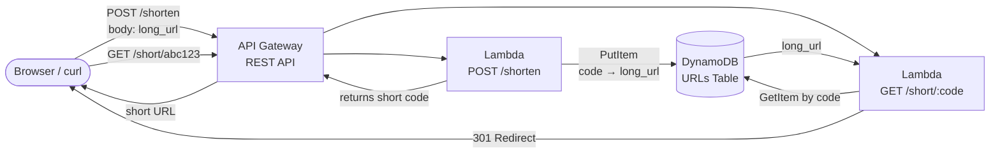
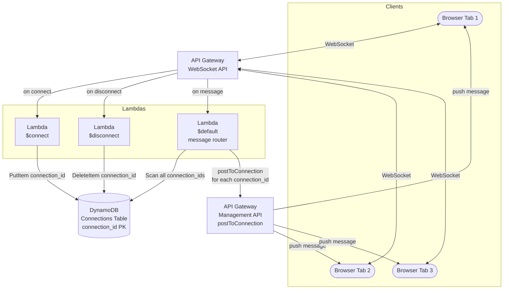
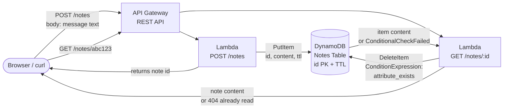
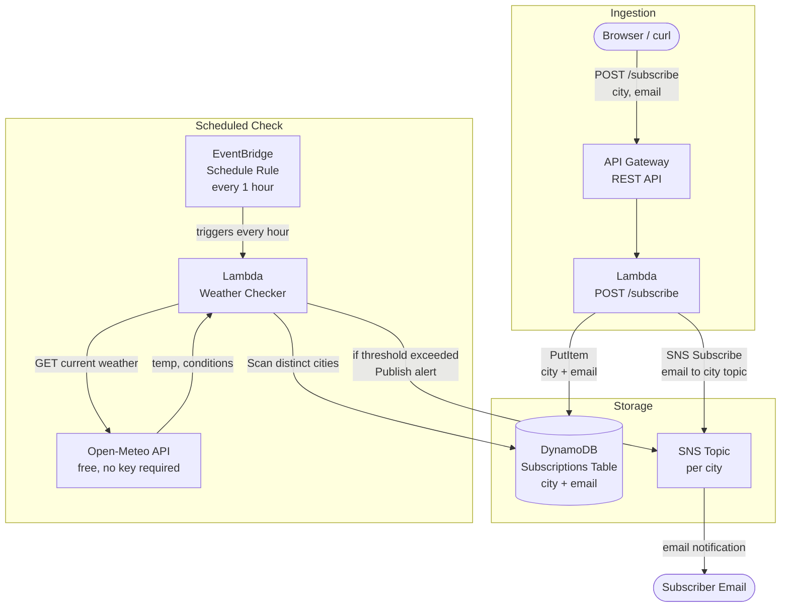

# DS5220 — Project-O-Rama

Choose **one** of the four projects below. Work in small groups (2–3 people) during class. The goal is to get something working end-to-end by the end of the session — polish and extensions are bonuses, not requirements.

All projects use **AWS** as the cloud provider. You'll need your course AWS account and credentials configured.

**Contents**

- [URL Shortener](#project-1--url-shortener)
- [Real-time Group Chat](#project-2--real-time-group-chat)
- [Burner Notes](#project-3--ephemeral-note-sharing-burn-after-reading)
- [Weather Alerts](#project-4--weather-alert-subscription-service)

---

## Project 1 — URL Shortener

### Overview

Build a serverless URL shortener: a user submits a long URL, gets back a short code (e.g. `https://xyz.execute-api.us-east-1.amazonaws.com/short/abc123`), and visiting that short URL redirects them to the original. Simple, classic, and surprisingly complete as a system.

### Architecture



### What You're Building

| Endpoint | Method | Description |
|----------|--------|-------------|
| `/shorten` | `POST` | Accept a JSON body `{"url": "https://..."}`, store it, return a short code |
| `/short/{code}` | `GET` | Look up the code in DynamoDB, return a `301` redirect |

### AWS Services

- **API Gateway** — REST API with two routes
- **Lambda** — one function per route (or one function with routing logic)
- **DynamoDB** — single table with `code` as the partition key; store `long_url` and optionally `created_at`

### Key Implementation Notes

- Generate short codes with Python's `secrets.token_urlsafe(6)` or similar — 6–8 characters is plenty
- The redirect Lambda must return an HTTP `statusCode: 301` header with a `Location` header pointing to the original URL
- Add a `ttl` attribute (Unix timestamp) to DynamoDB items and enable TTL on the table — links can expire automatically
- Consider what happens if someone submits the same URL twice — do you deduplicate?

### Example

In this course we have been using the `l.uvasds.sh` shortener written by the instructor. This
has a similar configuration where the `/zz-shorten` resource requires a POST of a single data
field named `original-url` and then returns the generated short URL. The `/` zone apex resource
is reserved for the short URLs themselves (thus keeping them shorter!).

You can test your own posts against this service with
```
curl -X POST https://l.uvasds.sh/zz-shorten \
  -H "Content-Type: application/json" \
  -d '{"original-url": "https://www.kodak.com/"}'
```

### Stretch Goals

- A minimal HTML form frontend (static site on S3) so users don't need curl
- Click tracking: increment a counter in DynamoDB on each redirect
- Custom alias support: let users specify their own short code
- Custom domains can be mapped to the API Gateway service. This is exactly how `https://l.uvasds.sh/` is configured.

### Reference Code & Examples

- [AWS Serverless URL Shortener (official sample)](https://github.com/aws-samples/amazon-api-gateway-url-shortener) — full SAM-based reference implementation; good for architecture inspiration
- [Serverless URL Shortener — step-by-step tutorial](https://dev.to/aws-builders/building-a-serverless-url-shortener-with-aws-lambda-api-gateway-and-dynamodb-2a3e) — walkthrough with console + boto3
- [DynamoDB TTL docs](https://docs.aws.amazon.com/amazondynamodb/latest/developerguide/TTL.html)
- [API Gateway redirect (HTTP integration)](https://docs.aws.amazon.com/apigateway/latest/developerguide/how-to-mock-integration.html)

---

## Project 2 — Real-Time Group Chat

### Overview

Build a multi-user real-time chat app — think a stripped-down Slack channel or IRC room. Multiple browser tabs (or people) can connect simultaneously and see each other's messages appear instantly. No LLM, no AI — this is a pure distributed systems problem about maintaining state across stateless serverless infrastructure.

### Architecture



### What You're Building

A WebSocket API with three Lambda handlers:

| Route | Lambda | What it does |
|-------|--------|--------------|
| `$connect` | connect handler | Saves the new `connectionId` to DynamoDB |
| `$disconnect` | disconnect handler | Deletes the `connectionId` from DynamoDB |
| `$default` | message handler | Scans all `connectionId`s, broadcasts the message to each one via the Management API |

A minimal React (or plain HTML/JS) frontend that opens a WebSocket connection and renders incoming messages.

### AWS Services

- **API Gateway** — WebSocket API (different from REST API — create it as type "WebSocket")
- **Lambda** — three functions (connect, disconnect, message)
- **DynamoDB** — single table with `connectionId` as the partition key
- **API Gateway Management API** — used inside the message Lambda to push messages back to connected clients

### Key Implementation Notes

- The WebSocket URL from API Gateway looks like: `wss://{api-id}.execute-api.{region}.amazonaws.com/{stage}`
- The message Lambda must call the **Management API**, not the regular API Gateway. The endpoint is `https://{api-id}.execute-api.{region}.amazonaws.com/{stage}` — construct this from the Lambda's event context
- Your message Lambda needs permission to call `execute-api:ManageConnections` — add this to its IAM role
- When broadcasting, if `postToConnection` throws a `GoneException`, the client disconnected ungracefully — delete that `connectionId` from DynamoDB and continue
- Use DynamoDB TTL (set `ttl` to `now + 2 hours`) to auto-clean stale connections

### Frontend Sketch (plain JS)

```javascript
const ws = new WebSocket("wss://your-api-id.execute-api.us-east-1.amazonaws.com/prod");

ws.onmessage = (event) => {
  const msg = JSON.parse(event.data);
  appendMessageToUI(msg);
};

function sendMessage(text) {
  ws.send(JSON.stringify({ username: "alice", message: text }));
}
```

### Stretch Goals

- Usernames: pass a `?username=` query parameter on the WebSocket connect URL and store it in DynamoDB alongside `connectionId`
- Room support: add a `room` attribute to DynamoDB and only broadcast to connections in the same room
- Message history: store recent messages in a separate DynamoDB table and send them to new connections on `$connect`

### Reference Code & Examples

- [AWS WebSocket Chat App (official sample)](https://github.com/aws-samples/websocket-chat-application) — the canonical reference; SAM-based, very close to what you're building
- [AWS WebSocket API docs](https://docs.aws.amazon.com/apigateway/latest/developerguide/apigateway-websocket-api.html)
- [Managing WebSocket connections (Management API)](https://docs.aws.amazon.com/apigateway/latest/developerguide/apigateway-how-to-call-websocket-api-connections.html)
- [React WebSocket hook example](https://github.com/robtaussig/react-use-websocket) — `react-use-websocket` library if you want a cleaner React integration

---

## Project 3 — Ephemeral Note Sharing ("Burn After Reading")

### Overview

Build a "burn after reading" note service. A user POSTs a secret note and gets back a short ID. Anyone with that ID can retrieve the note **exactly once** — after the first read, the note is permanently deleted. Notes also expire automatically after 24 hours whether they've been read or not.

This is a great exercise in DynamoDB conditional writes, atomic operations, and TTL-based expiry.

### Architecture



### What You're Building

| Endpoint | Method | Description |
|----------|--------|-------------|
| `/notes` | `POST` | Accept a JSON body `{"message": "..."}`, store it with a TTL, return a note ID |
| `/notes/{id}` | `GET` | Delete-and-return the note atomically; return 404 if already read or expired |

### AWS Services

- **API Gateway** — REST API with two routes
- **Lambda** — one function per route
- **DynamoDB** — single table with `id` as partition key; store `content` and `ttl`

### Key Implementation Notes

The core technical challenge is the **atomic delete-and-return**. You must not read the item and then delete it in two separate calls — another request could read it between your two calls. Use DynamoDB's `delete_item` with a `ConditionExpression`:

```python
import boto3
from boto3.dynamodb.conditions import Attr

dynamodb = boto3.resource('dynamodb')
table = dynamodb.Table('notes')

try:
    response = table.delete_item(
        Key={'id': note_id},
        ConditionExpression=Attr('id').exists(),
        ReturnValues='ALL_OLD'   # Returns the deleted item's content
    )
    content = response['Attributes']['content']
except dynamodb.meta.client.exceptions.ConditionalCheckFailedException:
    # Note was already deleted (read) or never existed
    return {'statusCode': 404, 'body': 'Note not found or already read'}
```

- Configure TTL as a setting **when you create the DynamoDB table**. Refer to AWS documentation for how to do this.
- Set `ttl` as a Unix timestamp (`int(time.time()) + 86400` for 24 hours) and **enable TTL on the table** pointing at the `ttl` attribute
- Note: DynamoDB TTL deletion is eventual (within ~48 hours) — for a true hard expiry, check `ttl > time.time()` in your read Lambda before returning

### Stretch Goals

- Password protection: store an optional bcrypt-hashed passphrase alongside the note; require it on retrieval
- View counter: instead of single-read, allow a configurable number of reads (e.g. `max_reads: 3`) and decrement atomically using DynamoDB's `UpdateItem` with `ADD` and a condition on the counter
- A simple frontend that shows a "note burned" animation after first read

### Reference Code & Examples

- [DynamoDB conditional writes docs](https://docs.aws.amazon.com/amazondynamodb/latest/developerguide/Expressions.ConditionExpressions.html) — essential reading for the atomic delete pattern
- [DynamoDB TTL docs](https://docs.aws.amazon.com/amazondynamodb/latest/developerguide/TTL.html)
- [Similar project walkthrough — SnapMsg](https://dev.to/aws-builders/building-a-one-time-secret-sharing-service-on-aws-4da5) — one-time secret sharing on AWS, very similar architecture
- [boto3 delete_item reference](https://boto3.amazonaws.com/v1/documentation/api/latest/reference/services/dynamodb/table/delete_item.html)

---

## Project 4 — Weather Alert Subscription Service

### Overview

Build a weather alert service: users subscribe their email address to alerts for a specific city. A scheduled Lambda (EventBridge) runs every hour, fetches current weather data for each subscribed city from a free weather API, compares it against a threshold (e.g. temperature > 95°F or weather condition = "Thunderstorm"), and fires off SNS email notifications to subscribers.

### Architecture



### What You're Building

| Component | Description |
|-----------|-------------|
| `POST /subscribe` | Accept `{"city": "Charlottesville, VA", "email": "you@example.com"}`, store in DynamoDB, subscribe email to SNS topic |
| Weather check Lambda | Runs on a schedule; fetches weather for each subscribed city; publishes to SNS if threshold exceeded |
| EventBridge rule | Cron trigger for the weather check Lambda |

### AWS Services

- **API Gateway** — REST API, one route
- **Lambda** — two functions (subscribe handler, weather checker)
- **DynamoDB** — subscriptions table with `city` (PK) and `email` (SK), or a flat list
- **SNS** — one topic per city, or a single topic with message filtering
- **EventBridge** — scheduled rule to trigger the weather checker

### Key Implementation Notes

**Use the [Open-Meteo API](https://open-meteo.com/)** — it's completely free, requires no API key, and supports geocoding + current conditions in a single call:

```python
import requests

# Step 1: geocode city name to lat/lon
geo = requests.get(
    "https://geocoding-api.open-meteo.com/v1/search",
    params={"name": "Charlottesville", "count": 1}
).json()
lat = geo['results'][0]['latitude']
lon = geo['results'][0]['longitude']

# Step 2: fetch current weather
weather = requests.get(
    "https://api.open-meteo.com/v1/forecast",
    params={
        "latitude": lat,
        "longitude": lon,
        "current_weather": True,
        "temperature_unit": "fahrenheit"
    }
).json()
temp = weather['current_weather']['temperature']
```

- For SNS email subscriptions, the first subscribe will trigger a **confirmation email** to the subscriber — they must click the link before they'll receive alerts. In class, use your own email for testing.
- Lambda needs IAM permissions for: `dynamodb:Scan`, `dynamodb:PutItem`, `sns:Subscribe`, `sns:Publish`, `sns:CreateTopic`
- For EventBridge, a cron expression like `rate(1 hour)` is simplest; use `rate(5 minutes)` during testing

### Stretch Goals

- Let users set their own threshold (e.g. "alert me when temp > X") stored in DynamoDB
- Add an `Unsubscribe` endpoint that calls `sns:Unsubscribe` and removes the DynamoDB record
- Support multiple alert types (temperature high, temperature low, rain, thunderstorm) as separate SNS topics

### Reference Code & Examples

- [Open-Meteo API docs](https://open-meteo.com/en/docs) — free weather API, no key needed, excellent documentation
- [AWS SNS email subscription example (boto3)](https://boto3.amazonaws.com/v1/documentation/api/latest/reference/services/sns/client/subscribe.html)
- [EventBridge scheduled rules docs](https://docs.aws.amazon.com/eventbridge/latest/userguide/eb-create-rule-schedule.html)
- [AWS SNS + Lambda + EventBridge pattern (AWS samples)](https://github.com/aws-samples/aws-cdk-examples/tree/master/python/lambda-cron) — cron + Lambda reference
- [Similar project walkthrough](https://hands-on.cloud/building-weather-station-app-with-aws-iot-core-and-python/) — IoT-flavored but same SNS/Lambda/EventBridge core

---

## General Tips for All Projects

- **Start with IAM.** Most failures in the first 20 minutes are permissions errors. Write down what your Lambda needs to do and make sure its execution role has those permissions before writing any other code.
- **Test Lambdas in isolation first.** Use the Lambda console's test event feature before wiring up API Gateway or EventBridge.
- **CloudWatch Logs are your friend.** Every Lambda invocation logs to `/aws/lambda/{function-name}` — check there first when something doesn't work.
- **Keep it simple.** A working end-to-end MVP beats a half-finished feature-complete app. Get the core loop working first, then add stretch goals.
- **Tear down when done.** Delete your Lambda functions, DynamoDB tables, API Gateway APIs, and SNS topics at the end of class to avoid charges.

